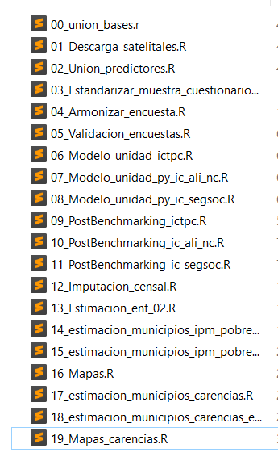

# Introducción {-}

Este manual se desarrolla como una herramienta para detallar el paso a paso seguido por la Comisión Económica para América Latina y el Caribe (CEPAL) en la obtención de estimaciones del indicador multidimensional de pobreza en México. El proceso utiliza técnicas de estimación de áreas pequeñas y métodos de Monte Carlo. Aunque el procedimiento se describe con los códigos de 2020, el proceso para 2015 es similar, con pequeñas variaciones. Sin embargo, la esencia y los principios fundamentales son los mismos en ambos periodos.

### Respositodio de códigos {-}

-   En el siguiente enlace encontrará las rutinas de R desarrolladas para la estimación del IPM [Descargar](https://git.cepal.org/ATsae/coneval2024/-/tree/main/rcodes/2020)

### Estructura del Proyecto {-}

Para el desarrollo de los scripts, se estructuró un proyecto en *R* que cuenta con la siguiente organización:

- **`rcodes`**: En esta carpeta se encuentran los diferentes códigos desarrollados para cada año. Dentro de ella, hay subcarpetas específicas para 2020 y 2015, correspondientes a los años en los que se realizaron los cálculos de los indicadores de carencias y del Índice de Pobreza Multidimensional (IPM). Dentro de estas subcarpetas, los scripts están enumerados en orden de ejecución, como se muestra en la imagen a continuación:

    [{width="400"}](fig_lista_archivo)

**Cada subcarpeta contiene una serie de scripts organizados secuencialmente, asegurando que el proceso de cálculo y análisis se realice de manera ordenada y reproducible.** Esta estructura facilita la identificación y ejecución de cada paso necesario para obtener los resultados del análisis de pobreza multidimensional.

- **`input`**: Esta carpeta contiene dos subcarpetas, una para 2015 y otra para 2020. En cada una de estas encontraremos la base de datos de la ENIGH, la encuesta ampliada del censo para el 2020 o la encuesta intercensal para el 2015, además de las variables predictoras a nivel de municipios. También incluye un archivo en formato CSV que contiene las líneas de pobreza para el año que se esté procesando.

- **`output`**: Esta carpeta sigue la misma estructura, con subcarpetas para 2015 y 2020. En cada una de estas subcarpetas encontraremos la carpeta de iteraciones, donde están disponibles los resultados de las iteraciones realizadas por cada estado para cada uno de los municipios. También dispone de una subcarpeta de modelos que contiene los modelos estimados para cada una de las carencias, así como algunos gráficos de validación. Además, encontraremos la carpeta de intermedias necesarias para el procesamiento de información o para el almacenamiento de algunos resultados.

- **`shapefile`**: Aquí están disponibles los shapefiles para la realización de mapas y descarga de información satelital, que son utilizados como covariables en la implementación del modelo.

Esta organización permite mantener un flujo de trabajo claro y estructurado, donde cada script y conjunto de datos desempeñan un papel específico en el proceso general, desde la preparación de datos hasta la generación de resultados finales.

### Librerias de *R* y otros insumos {-}

En el siguiente apartado, se describe el conjunto de librerías utilizadas para el desarrollo de este proyecto, así como una breve descripción de las bases de datos empleadas.

#### Librerías Utilizadas {-}

##### Manipulación y Transformación de Datos {-}

-   **`tidyverse`**: Conjunto de paquetes (incluyendo `dplyr`, `ggplot2`, `tibble`, `readr`, `purrr`, `tidyr`, y `stringr`) que facilitan la manipulación y visualización de datos de manera coherente y eficiente.
-   **`data.table`**: Proporciona herramientas rápidas y eficientes para la manipulación de grandes conjuntos de datos tabulares.
-   **`dplyr`**: Parte del `tidyverse`, facilita la manipulación de datos mediante verbos intuitivos como `select`, `filter`, `mutate`, `summarize`, y `arrange`.
-   **`magrittr`**: Introduce el operador `%>%`, permitiendo una escritura de código más clara y encadenada.
-   **`purrr`**: Extiende las capacidades de programación funcional para trabajar con listas y vectores.
-   **`furrr`**: Permite realizar operaciones paralelas utilizando `purrr` y `future`.
-   **`stringr`**: Simplifica la manipulación de cadenas de caracteres mediante funciones intuitivas.
-   **`labelled`**: Facilita la manipulación de datos etiquetados, comúnmente utilizados en encuestas y datos sociológicos.

##### Lectura y Escritura de Datos {-}

-   **`openxlsx`**: Permite la creación, lectura y manipulación de archivos Excel sin depender de software adicional.
-   **`haven`**: Permite leer y escribir datos en formatos usados por otros programas estadísticos como SPSS, Stata y SAS.
-   **`readstata13`**: Especializado en la lectura de archivos Stata versión 13, asegurando compatibilidad con datos antiguos.

##### Análisis de Datos de Encuestas {-}

-   **`survey`**: Proporciona herramientas para el análisis de datos de encuestas complejas, incluyendo ponderaciones y diseños de muestras.
-   **`srvyr`**: Ofrece una interfaz más amigable basada en `dplyr` para trabajar con el paquete `survey`.
-   **`TeachingSampling`**: Incluye métodos y herramientas para realizar muestreo en investigaciones educativas.
-   **`samplesize4surveys`**: Facilita el cálculo del tamaño de muestra necesario para encuestas, asegurando resultados estadísticamente significativos.
-   **`convey`**: Extiende `survey` para analizar medidas de desigualdad y pobreza en datos de encuestas.

##### Modelado y Análisis Estadístico {-}

-   **`rstan`**: Interfaz de R para Stan, que realiza modelado bayesiano avanzado, permitiendo la creación de modelos complejos.
-   **`lme4`**: Proporciona herramientas para ajustar y analizar modelos lineales y no lineales de efectos mixtos.
-   **`car`**: Incluye diversas herramientas para la regresión aplicada y diagnósticos de modelos.
-   **`randomForest`**: Implementa algoritmos de bosque aleatorio para clasificación y regresión.
-   **`caret`**: Ofrece una amplia gama de herramientas para la creación y validación de modelos de aprendizaje automático.
-   **`nortest`**: Contiene pruebas para evaluar la normalidad de los datos, esencial en muchos análisis estadísticos.

##### Visualización de Datos {-}

-   **`ggplot2`**: Parte del `tidyverse`, es una potente herramienta para la visualización de datos basada en la gramática de gráficos.
-   **`DataExplorer`**: Simplifica la exploración inicial y la generación de reportes de datos.
-   **`thematic`**: Facilita la personalización de temas gráficos en `ggplot2`, permitiendo una estética consistente.
-   **`patchwork`**: Permite combinar múltiples gráficos de `ggplot2` en una única visualización coherente.
-   **`tmap`**: Especializado en la creación de mapas temáticos, útil para visualizar datos geoespaciales.
-   **`sf`**: Proporciona una estructura eficiente para manipular datos espaciales, facilitando la integración con `ggplot2` y `tmap`.

##### Informes y Reproducibilidad {-}

-   **`printr`**: Mejora el formato de la impresión de resultados en R Markdown, haciendo los informes más legibles.
-   **`knitr`**: Herramienta clave para la creación de informes dinámicos y reproducibles, integrando código y texto.

##### Integración con Otros Lenguajes {-}

-   **`reticulate`**: Facilita la interoperabilidad entre R y Python, permitiendo ejecutar código de Python dentro de un entorno de R.

### Bases de Datos Utilizadas {-}

Para este proyecto, se emplearon diversas bases de datos que incluyen:

-   **Encuesta Nacional de Ingresos y Gastos de los Hogares (ENIGH)**: Proporciona información detallada sobre los ingresos y gastos de los hogares en México. Esta encuesta es crucial para entender los patrones de consumo y el bienestar económico de la población.
-   **Formulario Ampliado del Censo 2020**: Ofrece datos sociodemográficos detallados a nivel de hogar y persona. Esta fuente es esencial para capturar una amplia gama de variables necesarias para el análisis multidimensional de la pobreza.
-   **Encuesta Intercensal de 2015**: Complementa la información del censo con datos adicionales recopilados entre periodos censales. Proporciona una actualización intermedia de las condiciones demográficas y socioeconómicas.
-   **Imágenes Satelitales**: Proveen datos geoespaciales esenciales para capturar la diversidad de las condiciones de vida en México. Estas imágenes ayudan a incorporar información espacial detallada en los modelos de estimación.

Estas librerías y bases de datos son fundamentales para la implementación de la metodología de estimación del Índice de Pobreza Multidimensional (IPM) y otras carencias en los distintos municipios de México.

### Indicadores procesados{-}

En esta sección se presentan los diferentes indicadores utilizados para medir y analizar la situación de pobreza y vulnerabilidad en la población. A continuación, se describen los indicadores procesados:

- Población en situación de pobreza multidimensional (I)
  - Población en situación de pobreza moderada
  - Población en situación de pobreza extrema

- Población vulnerable por carencias sociales (II)

- Población vulnerable por ingresos (III)

- Población no pobre multidimensional y no vulnerable (IV)

Los indicadores de pobreza multidimensional se procesan específicamente para el estado 02 en el archivo *13_Estimacion_ent_02.R* y para los demás estados en el archivo *14_estimacion_municipios_ipm_pobreza.R*. Para la estimación del error asociado a estos indicadores, se utiliza el archivo *15_estimacion_municipios_ipm_pobreza_error.R*.

A continuación se listan las carencias estimadas:

- Población con al menos una carencia social (tol_ic_1)
- Población con al menos tres carencias sociales (tol_ic_2)
- Carencia por acceso a la seguridad social (ic_segsoc)
- Carencia por acceso a la alimentación nutritiva y de calidad (ic_ali_nc)
- Población con ingreso inferior a la línea de pobreza extrema por ingresos (pobrea_li)
- Población con ingreso inferior a la línea de pobreza por ingresos (pobrea_lp)

Las carencias mencionadas se procesan utilizando los archivos *17_estimacion_municipios_carencias.R* y *18_estimacion_municipios_carencias_error.R*.

Por otro lado, las carencias observadas en la muestra intercensal y en la muestra ampliada del censo no fueron estimados debido a que fueron observados para los municipios y estos son listados a continuación. 

- Rezago educativo
- Carencia por acceso a los servicios de salud
- Carencia por calidad y espacios de la vivienda
- Carencia por acceso a los servicios básicos en la vivienda

